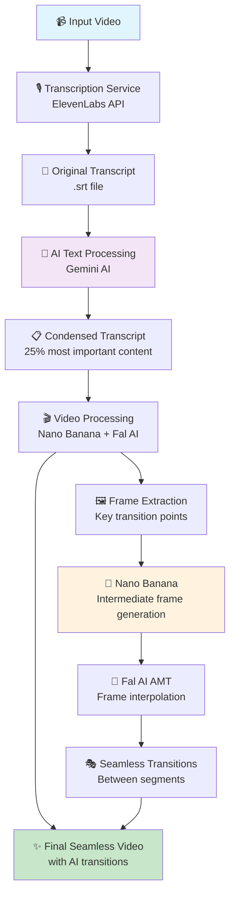

# In-Transit 🎬✨

An AI-powered video processing pipeline that transforms long-form content into engaging, condensed videos with seamless AI transitions. Built for the Google Nano Banana Hackathon in San Francisco (September 6-7, 2025).

## 🏆 Hackathon Achievement

This project was developed during the 48-hour Google Nano Banana Hackathon hosted by Google DeepMind and Cerebral Valley in San Francisco. The hackathon featured Gemini 2.5 Flash Image Preview (Nano Banana) and had a prize pool exceeding $400,000 with partnerships from Fal AI and ElevenLabs.

## 🚀 How It Works

In-Transit transforms lengthy videos into concise, engaging content through an intelligent 3-stage pipeline:



## 🎯 Features

### 🔥 **Seamless Mode** (Default)
- **AI-Powered Transitions**: Uses Google's Nano Banana model for intelligent intermediate frame generation
- **Frame Interpolation**: Fal AI's AMT technology creates smooth transitions between video segments
- **Content Intelligence**: Gemini AI identifies and preserves the most important 25% of content

### ⚡ **Jump-Cut Mode**
- **Rapid Processing**: Fast-paced video creation with direct segment stitching
- **No Transitions**: Perfect for quick content summaries

### ✂️ **Manual Cut Mode**
- **Precise Control**: Manual video cutting based on `xxx` timestamps
- **Frame Extraction**: Saves transition frames for manual editing

## 🛠️ Installation

```bash
# Clone the repository
git clone https://github.com/yourusername/in-transit.git
cd in-transit

# Install dependencies
pip install moviepy fal-client google-generativeai opencv-python pillow numpy requests python-dotenv

# Set up your API keys
cp .env.example .env
# Edit .env with your API keys
```

## 🔑 API Keys Setup

Create a `.env` file in the root directory:

```env
ELEVENLABS_API_KEY="your_elevenlabs_api_key"
GEMINI_API_KEY="your_google_gemini_api_key"
FAL_KEY="your_fal_api_key"
```

### Where to get API keys:
- **ElevenLabs**: [https://elevenlabs.io/](https://elevenlabs.io/)
- **Google Gemini**: [https://makersuite.google.com/app/apikey](https://makersuite.google.com/app/apikey)
- **Fal AI**: [https://fal.ai/](https://fal.ai/)

## 🎮 Usage

### One-Command Pipeline

The simplest way to use In-Transit - run the complete pipeline with a single command:

```bash
cd scripts
python transcription_service.py --video your_video.mp4
```

This will automatically:
1. 🎙️ Transcribe your video using ElevenLabs
2. 🤖 Process and condense the transcript with Gemini AI  
3. 🎬 Generate the final seamless video with AI transitions

### Advanced Usage

For more control over the process:

```bash
# Seamless mode with custom settings
python scripts/video_cutter2.py --mode seamless --video video.mp4 --transcript transcript.srt --amt-fps 12 --amt-passes 2

# Jump-cut mode (faster processing)
python scripts/video_cutter2.py --mode jumpcut --video video.mp4 --transcript transcript.srt

# Manual cutting mode
python scripts/video_cutter2.py --mode manualcut --video video.mp4 --transcript transcript.srt
```

## 📁 Project Structure

```
in-transit/
├── scripts/
│   ├── transcription_service.py    # 🎙️ Main pipeline entry point
│   ├── text_process.py            # 🤖 AI text processing
│   └── video_cutter2.py           # 🎬 Video processing with AI transitions
├── media/                         # 📹 Input videos
├── output/                        # 📤 Generated transcripts and videos
├── docs/                          # 📚 Documentation
└── .env                          # 🔑 API keys (create this)
```

## 🎬 Example Output

**🔥 [Download the example video: `media/condensed_GreekFinCrisis_seamless.mp4`](./media/condensed_GreekFinCrisis_seamless.mp4)**

This demonstrates our complete pipeline processing a Greek Financial Crisis educational video:

- **📹 Original**: 8-minute educational video about the Greek Financial Crisis
- **✨ Processed**: **2-minute condensed version** with seamless AI transitions
- **📊 Compression**: **75% reduction** in length while preserving key information
- **🔄 AI Magic**: 12 seamless transitions generated using:
  - 🍌 **Nano Banana**: Intelligent intermediate frame generation
  - 🔄 **Fal AI AMT**: Advanced frame interpolation
  - 🤖 **Gemini AI**: Content analysis for optimal segment selection

**Try it yourself:**
```bash
cd scripts
python transcription_service.py --video GreekFinCrisis.mp4
```

The processed video demonstrates how In-Transit intelligently identifies the most important segments of educational content and creates smooth transitions that maintain narrative flow.

## 🧪 Technologies Used

- **🍌 Google Nano Banana (Gemini 2.5 Flash)**: Intelligent intermediate frame generation
- **🎙️ ElevenLabs**: High-quality speech-to-text transcription
- **🔄 Fal AI AMT**: Advanced frame interpolation for seamless transitions
- **🎬 MoviePy**: Video processing and manipulation
- **🖼️ OpenCV**: Computer vision and frame alignment
- **📝 Gemini AI**: Content analysis and transcript processing

## 🏗️ Architecture

In-Transit uses a modular architecture with three main components:

1. **Transcription Layer**: Converts audio to timestamped text
2. **Intelligence Layer**: AI-powered content analysis and condensation  
3. **Synthesis Layer**: Video reconstruction with AI-generated transitions

Each layer is optimized for quality and performance, with graceful fallbacks and error handling.

## 🎯 Hackathon Judging Criteria Achievement

- **✨ Innovation & Wow Factor (40%)**: Novel use of Nano Banana for video transition generation
- **⚙️ Technical Execution (30%)**: Robust pipeline with multiple AI services integration
- **🌍 Impact & Utility (20%)**: Solves real content creation challenges for educators and creators
- **🎤 Presentation Quality (10%)**: Clear documentation and example demonstrations

## 🚧 Future Enhancements

- 🌐 Web interface for easier video processing
- 🎨 Custom transition styles and effects
- 📊 Analytics dashboard for content optimization
- 🔀 Batch processing for multiple videos
- 🎯 Industry-specific content templates

## 🤝 Contributing

Built during the Nano Banana Hackathon! Contributions welcome for post-hackathon improvements.

## 📄 License

MIT License - Feel free to use and modify for your projects!

---

*Created with ❤️ during the Google Nano Banana Hackathon 2025 in San Francisco*